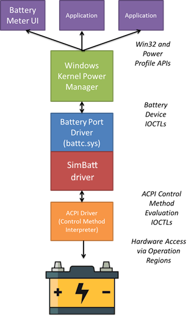

Mock driver to simulate multi-battery setups and test Windows power management. Based on the Microsoft [Simulated Battery Driver Sample](https://github.com/microsoft/Windows-driver-samples/tree/main/simbatt) sample with some modifications to ease multi-battery testing and failure handling without requiring physical battery packs.

Tutorial: [Writing Battery Miniclass Drivers](https://learn.microsoft.com/en-us/windows-hardware/drivers/battery/writing-battery-miniclass-drivers)

  

## How to test
It's recommended to **test in a disposable virtual machine (VM)** during development, since faulty drivers might crash or corrupt the computer. You can use the "checkpoint" feature to roll back the machine to a known good state in case of driver installations problems.

### Prerequisites
Prerequisites for the _host_ computer:
* Install [Visual Studio](https://visualstudio.microsoft.com/).
* Install [Windows Driver Kit (WDK)](https://learn.microsoft.com/en-us/windows-hardware/drivers/download-the-wdk).
* (optional) Install [WiX toolset](https://wixtoolset.org/) for MSI installer packaging.

Prerequisites for the _target_ computer:
* Disable Secure Boot in UEFI/BIOS.
* Enable test-signed drivers: [`bcdedit /set testsigning on`](https://learn.microsoft.com/en-us/windows-hardware/drivers/install/the-testsigning-boot-configuration-option)
* Enable kernel debugging: `bcdedit /debug on` (optional)

### Test instruction
You can with the driver **make Windows believe that it’s being powered by one or more battery packs** – even if running from a AC-powered VM.

Steps:
* Build solution in Visual Studio or download binaries from [releases](../../releases).
* Copy `BatteryConfig.exe`, `BatteryMonitor.exe` and the `simbatt` folder to the target machine.
* Run `INSTALL.bat` with admin privileges to install the driver with two simulated batteries.
* Run `BatteryConfig.exe <N> <Charge>`, where `<N>` is the simulated battery index and `<Charge>` is the new charge level, to modify the battery state. Example: `BatteryConfig.exe 1 90` to set the charge level of the first battery to 90%.
* Run `BatteryMonitor.exe` to monitor power events broadcasted to all application.
* Run `UNINSTALL.bat` with admin privileges to uninstall the driver and delete simulated batteries.

### Examples
Simulate 6 battery-packs:  


Battery status icons that can be simulated:
* Critical level:  (7% or less)
* Low level:  (10% or less)
* Battery saver:  (20% or less)
* Half full: 
* On AC power: 

Notification when simulating low-battery conditions:  


## Alternative approach
It's also possible to make an Arduino board emulate a UPS battery. This leverages the in-built Windows `hidbatt` driver, so there's no need for installing additional drivers. 
The [abratchik/HIDPowerDevice](https://github.com/abratchik/HIDPowerDevice) project provides sample code for this. There's also a working setup on the `battery` branch in the [forderud/HIDPowerDevice](https://github.com/forderud/HIDPowerDevice/tree/battery) fork.

Notice: You might need to [change CapacityMode from 2 (%) to 1 (mWh)](https://github.com/abratchik/HIDPowerDevice/pull/14) to make the "battery" charge show up correctly on laptops with existing batteries.


## Configuring Windows power management
Windows handling of low-battery situations can either be configured through the "Power Options" UI (run `powercfg.cpl` -> "Change plan settings" -> "Change advanced power settings"):  


... or using [Powercfg](https://learn.microsoft.com/en-us/windows-hardware/design/device-experiences/powercfg-command-line-options):
```
:: Display current power configuration 
PowerCfg.exe /query

:: Select power scheme (in-built schemes: SCHEME_MIN, SCHEME_MAX or SCHEME_BALANCED)
set SCHEME=SCHEME_BALANCED
```

Power saving configuration:
```
:: Select power sheme
PowerCfg.exe /setactive %SCHEME%

:: Sleep after after 4min on DC and never sleep on AC
PowerCfg.exe /setdcvalueindex %SCHEME% SUB_SLEEP STANDBYIDLE 240
PowerCfg.exe /setacvalueindex %SCHEME% SUB_SLEEP STANDBYIDLE 0

:: Turn off display after 5min on DC and 10min on AC
PowerCfg.exe /setdcvalueindex %SCHEME% SUB_VIDEO VIDEOIDLE 300
PowerCfg.exe /setacvalueindex %SCHEME% SUB_VIDEO VIDEOIDLE 600
```
Drivers can expose both standard and custom power setting parameters as documented on [Managing Device Performance States](https://learn.microsoft.com/en-us/windows-hardware/drivers/kernel/managing-device-performance-states). These power settings can afterwards be configured using `PowerCfg`.


Power event configuration for AC & DC mode:
```
:: Low battery level (percentage)
PowerCfg.exe /setacvalueindex %SCHEME% SUB_BATTERY BATLEVELLOW 10
PowerCfg.exe /setdcvalueindex %SCHEME% SUB_BATTERY BATLEVELLOW 10

:: Low battery notification (0=off, 1=on)
PowerCfg.exe /setacvalueindex %SCHEME% SUB_BATTERY BATFLAGSLOW 0
PowerCfg.exe /setdcvalueindex %SCHEME% SUB_BATTERY BATFLAGSLOW 0

:: Low battery action (0=do nothing, 1=sleep, 2=hibernate, 3=shut down)
PowerCfg.exe /setacvalueindex %SCHEME% SUB_BATTERY BATACTIONLOW 0
PowerCfg.exe /setdcvalueindex %SCHEME% SUB_BATTERY BATACTIONLOW 0

:: Critical battery level (percentage)
PowerCfg.exe /setacvalueindex %SCHEME% SUB_BATTERY BATLEVELCRIT 5
PowerCfg.exe /setdcvalueindex %SCHEME% SUB_BATTERY BATLEVELCRIT 5

:: Critical battery notification (0=off, 1=on)
PowerCfg.exe /setacvalueindex %SCHEME% SUB_BATTERY BATFLAGSCRIT 0
PowerCfg.exe /setdcvalueindex %SCHEME% SUB_BATTERY BATFLAGSCRIT 0

:: Critical battery action (0=do nothing, 1=sleep, 2=hibernate, 3=shut down)
PowerCfg.exe /setacvalueindex %SCHEME% SUB_BATTERY BATACTIONCRIT 0
PowerCfg.exe /setdcvalueindex %SCHEME% SUB_BATTERY BATACTIONCRIT 0
```

CPU power configuration for AC & DC mode:
```
:: Minimum processor state (percentage)
PowerCfg.exe /setacvalueindex %SCHEME% SUB_PROCESSOR PROCTHROTTLEMIN 5
PowerCfg.exe /setdcvalueindex %SCHEME% SUB_PROCESSOR PROCTHROTTLEMIN 5

:: System cooling policy (0=passive, 1=active)
PowerCfg.exe /setacvalueindex %SCHEME% SUB_PROCESSOR SYSCOOLPOL 1
PowerCfg.exe /setdcvalueindex %SCHEME% SUB_PROCESSOR SYSCOOLPOL 0

:: Maximum processor state (percentage)
PowerCfg.exe /setacvalueindex %SCHEME% SUB_PROCESSOR PROCTHROTTLEMAX 100
PowerCfg.exe /setdcvalueindex %SCHEME% SUB_PROCESSOR PROCTHROTTLEMAX 100
```

There are also many other settings available. Use `PowerCfg.exe /query` to view all settings. See [PowerSettings.ps1](./PowerSettings.ps1) for an example of API access and modification of power settings from a script.


## Battery parameters
Battery parameters from the battery miniclass driver will automatically be exposed through the [`Win32_Battery`](https://learn.microsoft.com/en-us/windows/win32/cimwin32prov/win32-battery) WMI class, so there's no need for implementing a WMI provider yourself.

### Accessing per-battery parameters
Per-battery parameters can either be accessed through a WMI high-level or IOCTL low-level interface:
* See the [BatteryParams.ps1](./BatteryParams.ps1) script for how to retrieve battery parameters through WMI.
* See the [\BatteryConfig](./\BatteryConfig) project for how to retrieve battery parameters through [`IOCTL_BATTERY_QUERY_INFORMATION`](https://learn.microsoft.com/en-us/windows/win32/power/ioctl-battery-query-information) and [`IOCTL_BATTERY_QUERY_STATUS`](https://learn.microsoft.com/en-us/windows/win32/power/ioctl-battery-query-status) control codes.


### Windows power events and aggregated parameters
Windows applications receive [`WM_POWERBROADCAST`](https://learn.microsoft.com/en-us/windows/win32/power/wm-powerbroadcast) events when the machine transitions between AC and battery power, as well as when suspening or resuming from low-power modes. Applications can also call [`GetSystemPowerStatus`](https://learn.microsoft.com/en-us/windows/win32/api/winbase/nf-winbase-getsystempowerstatus) to retrieve details about the power state and aggregated battery charge level. Take a look at the `BatteryMonitor` project for sample code.  


## Implementation details
This section is only intended for internal bookkeeping. Testers doesn't need to care about this.

### Persistent state
Registry flags used: `HKEY_LOCAL_MACHINE\SYSTEM\CurrentControlSet\Enum\ROOT\BATTERY\<DeviceNumber>\Device Parameters`

### simbatt modifications
The most prominent changes to the Microsoft [`simbatt`](https://github.com/microsoft/Windows-driver-samples/tree/main/simbatt) sample:
* Switch to default output folder.
* ~~Disable faulty read-back of state from registry through `GetSimBattStateFromRegistry` function: https://github.com/microsoft/Windows-driver-samples/pull/1064~~
* Clear BATTERY_INFORMATION `BATTERY_CAPACITY_RELATIVE` field to enable per-battery charge display in Windows Settings: https://github.com/microsoft/Windows-driver-samples/pull/1063
* Provide instructions for how to test the driver: https://github.com/microsoft/Windows-driver-samples/pull/1187
